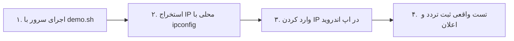

# سرویس یار — سامانه جامع هوشمند مدیریت ناوگان سرویس مدارس

[](https://github.com/mytest19861986/sch-srv-anti)
[](https://github.com/mytest19861986/sch-srv-anti/releases/tag/v1.2.0)
[](docs/ARCHITECTURE.md)

**سرویس یار** یک پلتفرم جامع، چندمستاجری (Multi-Tenant) و بلادرنگ برای مدیریت یکپارچه رفت‌وآمد دانش‌آموزان، مانیتورینگ زنده ناوگان، اطلاع‌رسانی پیامکی و نوتیفیکیشن به والدین و کنترل مالی/حسابداری سرویس مدارس است.

---

## 📦 دانلود مستقیم نسخه‌های رسمی (Official Downloads v1.2.0)

| محصول | فرمت | نسخه | حجم فایل | لینک دانلود مستقیم |
|---|---|---|---|---|
| 🚐 **اپلیکیشن راننده** | APK | `v1.2.0` | ۲۴.۰۱ MB | [دانلود مستقیم ir.serviceyar.driver-v1.2.0.apk](https://github.com/mytest19861986/sch-srv-anti/releases/download/v1.2.0/ir.serviceyar.driver-v1.2.0.apk) |
| 👨‍👩‍👧 **اپلیکیشن والدین** | APK | `v1.2.0` | ۲۲.۰۱ MB | [دانلود مستقیم ir.serviceyar.parent-v1.2.0.apk](https://github.com/mytest19861986/sch-srv-anti/releases/download/v1.2.0/ir.serviceyar.parent-v1.2.0.apk) |
| 📋 **یادداشت‌های انتشار** | Markdown | `v1.2.0` | — | [مشاهده Release Notes](docs/releases/v1.2.0-release-notes.md) |
| 🏷️ **صفحه رسمی Release** | GitHub | `v1.2.0` | — | [مشاهده Release v1.2.0 در گیت‌هاب](https://github.com/mytest19861986/sch-srv-anti/releases/tag/v1.2.0) |

---

## 🏠 راهنمای پایلوت خانگی روی شبکه Wi-Fi (Home Wi-Fi Pilot in 4 Steps)
با نسخه جدید **v1.1.0**، مدیران و تیم اجرایی می‌توانند بدون نیاز به خرید هاست یا دامنه، پایلوت آزمایشی را روی شبکه Wi-Fi خانگی یا مدرسه در ۴ گام ساده اجرا کنند:



> [!IMPORTANT]
> **نکته الزامی به‌روزرسانی سرور:** پس از هر `git pull`، حتماً `./demo.sh` (یا `launcher.py`) دوباره اجرا شود تا تغییرات جدید بک‌اند اعمال گردد.

1. **گام ۱ (اجرای سرور دمو):** در ترمینال سیستم خود اسکریپت دمو را اجرا کنید:
   ```bash
   bun run services/backend-api/src/server.ts
   # یا اجرای لانچر یکپارچه: python launcher.py
   ```
2. **گام ۲ (یافتن IP لوکال کامپیوتر):**
   - در ویندوز دستور `ipconfig` و در لینوکس `hostname -I` یا `ifconfig` را اجرا کرده و آی‌پی شبکه داخلی (مثلاً `192.168.1.10`) را یادداشت کنید.
3. **گام ۳ (تنظیم آدرس در اپلیکیشن):**
   - فایل APK راننده یا والدین را روی گوشی‌های متصل به همان Wi-Fi نصب کنید.
   - در پایین فرم لاگین روی «آدرس سرور» کلیک کرده و آدرس `http://192.168.1.10:3000` را وارد نمایید.
4. **گام ۴ (تست کامل و بدون تاخیر):**
   - با نام‌های کاربری دمو وارد شوید؛ وضعیت تردد را با یک لمس ثبت کنید و نوتیفیکیشن‌های بلادرنگ را روی گوشی اولیا مشاهده نمایید!

---

## ⚡ راه‌اندازی سریع پروداکشن (Production Wire-up)
جهت استقرار نهایی روی دامنه رسمی و هاست ابری:
```bash
# اجرای خودکار کیت اتصال و تولید کانفیگ‌ها
./scripts/wireup-setup.sh madresehyar.ir 5.22.133.45 arvancloud

# اجرای بررسی نهایی سلامت پروداکشن
./scripts/wireup-final-check.sh
```

---

## 🔑 اعتبارنامه‌های حساب‌های پیش‌فرض دمو (Demo Credentials)

| نقش کاربری | نام کاربری / ایمیل | رمز عبور | دسترسی مجاز |
|---|---|---|---|
| 🛡️ **مدیر کل (Super Admin)** | `admin@platform.ir` | `SuperPass@123` | پنل راهبری کلان کشوری (`/tenants`, `/audit-logs`) |
| 🏢 **مدیر مدرسه (School Admin)** | `school@mehr.ir` | `SchoolPass@123` | پنل مدرسه (`/students`, `/parents`, `/drivers`, `/routes`) |
| 🚐 **راننده (Driver)** | `driver@serviceyar.ir` | `DriverPass@123` | اپلیکیشن اندروید راننده و مانیفست تردد |
| 👨‍👩‍👧 **ولی دانش‌آموز (Parent)** | `parent@serviceyar.ir` | `ParentPass@123` | اپلیکیشن اندروید والدین و وضعیت زنده سرویس |

---

## 🏗️ نقشه مستندات فنی و ساختار پروژه (Documentation Map)

| حوزه مستندات | فایل مستند | شرح محتوا |
|---|---|---|
| 🚀 **راهنمای روز پایلوت** | [`docs/PILOT_DAY_RUNBOOK.md`](docs/PILOT_DAY_RUNBOOK.md) | سناریوهای اضطراری، زمان‌بندی و ماتریس وظایف روز اول پایلوت |
| 🌐 **کیت اتصال دامنه** | [`docs/WIREUP_QUICKSTART.md`](docs/WIREUP_QUICKSTART.md) | راهنمای ۵ دقیقه‌ای اتصال دامنه و هاست به پروژه |
| 📋 **لاگ تصمیمات (ADRs)** | [`docs/DECISION_LOG.md`](docs/DECISION_LOG.md) | تصمیمات ۵ گانه معماری و ممیزی‌های امنیتی |
| 🔍 **ممیزی منطق کسب‌وکار** | [`docs/CHATGPT_LOGIC_AUDIT.md`](docs/CHATGPT_LOGIC_AUDIT.md) | اعتبارسنجی صفر تا صد منطق توسط مشاور ChatGPT |
| 🏛️ **معماری سیستم** | [`docs/ARCHITECTURE.md`](docs/ARCHITECTURE.md) | معماری چندمستاجری ایزوله، Outbox Pattern و Caching |
