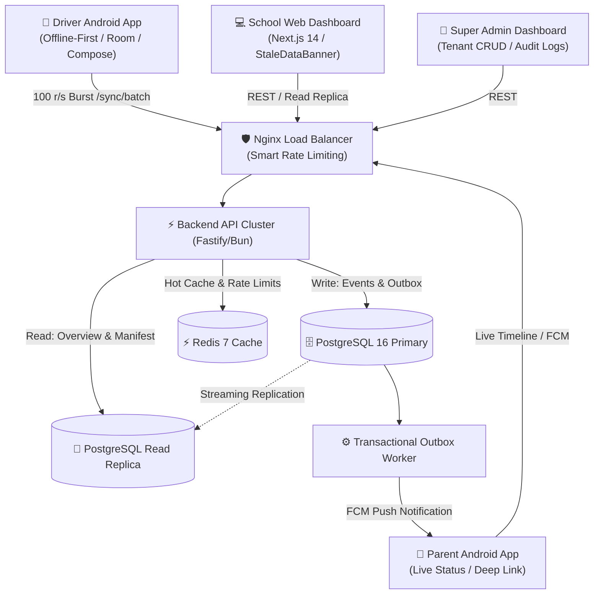

# 🚌 School Transport Platform (سامانه جامع مدیریت سرویس مدارس)

An enterprise-grade, offline-first, multi-tenant school transport management platform built with high throughput event-sourcing principles, Zero-Trust multi-tenancy, and decoupled asynchronous notifications.

---

## ⚡ Quick Start (Staging Deployment)

To run the complete production-grade stack (PostgreSQL Primary + Replica, Redis, LocalStack S3, Nginx, Backend API, and Outbox Worker) locally:

```bash
# 1. Clone repository
git clone https://github.com/mytest19861986/sch-srv-anti.git
cd sch-srv-anti

# 2. Execute one-command staging deployment
./scripts/deploy-staging.sh
```

### Accessing Endpoints & Applications
- 🌐 **API Gateway (Nginx)**: [http://localhost:80](http://localhost:80)
- 🚀 **Backend API Direct**: [http://localhost:3000](http://localhost:3000)
- 🏫 **School Web Dashboard**: [http://localhost:3001](http://localhost:3001)
- ⚙️ **Super Admin Web Dashboard**: [http://localhost:3002](http://localhost:3002)

---

## 🏗️ Architecture & Component Topology



---

## 🧪 Testing & Verification

Run the comprehensive test suite across all layers:

```bash
# Run backend integration tests (52 tests)
bun test services/backend-api

# Run shared web packages tests (7 tests)
bun test packages/i18n packages/auth packages/api-client

# Run full end-to-end integration tests (8 scenarios)
bun test tests/e2e
```

---

## 📚 Complete Documentation
- 📖 [Architecture Invariants & ADRs](docs/ARCHITECTURE.md)
- 🔐 [Security & Zero-Trust Guidelines](docs/SECURITY.md)
- 🔌 [Production Wire-up Guide](docs/WIRE_UP_GUIDE.md)
- 📋 [Final Handoff Checklist](docs/HANDOFF_CHECKLIST.md)
- 🚀 [Deployment & Runbooks](docs/DEPLOYMENT.md)
