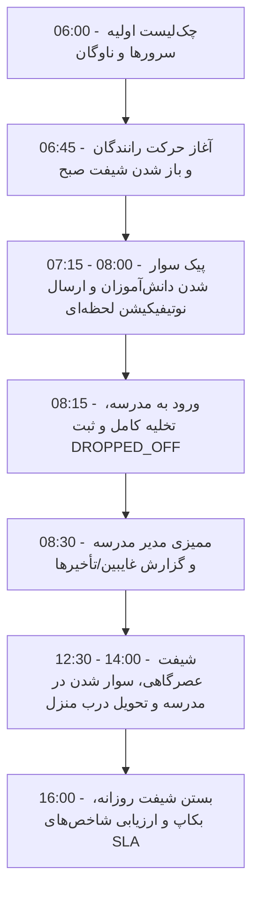

# 🚀 کتابچه راهنمای عملیاتی روز پایلوت میدانی (Pilot Day Operational Runbook)
**پروژه:** سامانه جامع مدیریت حمل‌ونقل و سرویس مدارس (School Transport Management System)  
**نسخه:** `v1.0.0` | **دستور کار اجرایی:** شماره ۵۴ (#54)  
**مخاطبان:** مدیران مدرسه، تیم عملیات میدانی، راهبران فنی (SRE/DevOps)، رانندگان و پشتیبانی اولیا  
**تاریخ انتشار:** آگوست ۲۰۲۶ | **وضعیت:** ✅ تأییدشده و آماده برای اجرای پایلوت (Production-Ready)  

---

## ۱. اهداف و چشم‌انداز پایلوت میدانی (Pilot Objectives)
هدف از این پایلوت، اعتبارسنجی عملیاتی سامانه در شرایط واقعی میدانی با ۱ مدرسه نمونه، ۱۰ دستگاه خودروی سرویس، ۳۰ راننده و ناوگان، و ۳۰۰ دانش‌آموز و والدین است.

---

## ۲. جدول زمان‌بندی دقیق روز پایلوت (Hour-by-Hour Execution Timeline)

### فاز ۱: آماده‌سازی پیش از شروع شیفت (۰۶:۰۰ تا ۰۶:۴۵)
| زمان | نقش مسئول | اقدام عملیاتی | معیار موفقیت / ابزار |
| :--- | :--- | :--- | :--- |
| **۰۶:۰۰** | راهبر سیستم / SRE | اجرای اسکریپت خودکار چک‌لیست روزانه پایلوت | اجرای `bun run scripts/pilot-daily-checklist.ts` و سبز بودن تمام مؤلفه‌ها |
| **۰۶:۱۵** | راهبر سیستم | بررسی دیتابیس، استخر اتصالات و صف Outbox | وضعیت صف `outbox_events` برابر با ۰ معلق |
| **۰۶:۳۰** | مدیر مدرسه | ورود به داشبورد وب مدرسه (`/students` و `/routes`) | بررسی انتساب کامل رانندگان به مسیرها و دانش‌آموزان |
| **۰۶:۴۵** | رانندگان | لاگین به اپلیکیشن راننده و دانلود مانیفست آفلاین | مشاهده لیست توقف‌ها و شماره تماس اضطراری اولیا |

---

### فاز ۲: اجرای شیفت صبحگاهی و اوج تردد (۰۷:۰۰ تا ۰۸:۱۵)
| زمان | نقش مسئول | اقدام عملیاتی | معیار موفقیت / ابزار |
| :--- | :--- | :--- | :--- |
| **۰۷:۰۰** | رانندگان | فشردن دکمه «شروع مسیر» (Start Route) | تغییر وضعیت شیفت به `IN_PROGRESS` در بک‌اند |
| **۰۷:۱۵ - ۰۸:۰۰** | رانندگان | ثبت تک‌لمسی سوار شدن هر دانش‌آموز (`PICKED_UP`) | ثبت رخداد در کمتر از ۵۰ میلی‌ثانیه |
| **۰۷:۱۵ - ۰۸:۰۰** | موتور Outbox | دیسپچ ناهمگام و موازی اعلان سوار شدن به اولیا | دریافت اعلان فشاری (Push) توسط والدین زیر ۲ ثانیه |
| **۰۷:۳۰** | اولیا | بررسی موقعیت و وضعیت زنده فرزند در اپلیکیشن اولیا | مشاهده تابلوی زمانی (Timeline) با نشان سبز |
| **۰۸:۰۰ - ۰۸:۱۵** | رانندگان | توقف در درب مدرسه و ثبت تخلیه همگانی (`DROPPED_OFF`) | قفل شدن ماشین وضعیت تردد روز جاری |

---

### فاز ۳: ممیزی و پایش صبحگاهی مدرسه (۰۸:۱۵ تا ۰۹:۰۰)
| زمان | نقش مسئول | اقدام عملیاتی | معیار موفقیت / ابزار |
| :--- | :--- | :--- | :--- |
| **۰۸:۱۵** | مدیر مدرسه | بررسی پنل غایبین و رویدادهای تردد (`/events`) | شناسایی فوری دانش‌آموزانی که سوار نشده‌اند |
| **۰۸:۳۰** | اپراتور مدرسه | تماس تک‌لمسی با اولیای دانش‌آموزان با وضعیت غایب | اطمینان از عدم جاماندن دانش‌آموز در طول مسیر |
| **۰۸:۴۵** | تیم پشتیبانی | بررسی مانیتورینگ سلامت، نرخ خطا و لاگ‌های امنیتی | نرخ خطای ۵xx زیر ۰.۰۱٪ و P99 زیر ۱۰۰ms |

---

### فاز ۴: شیفت عصرگاهی و بازگشت به منزل (۱۲:۳۰ تا ۱۴:۳۰)
| زمان | نقش مسئول | اقدام عملیاتی | معیار موفقیت / ابزار |
| :--- | :--- | :--- | :--- |
| **۱۲:۳۰** | مدیر مدرسه | بررسی گزارش‌های مرخصی و غیبت ثبت‌شده توسط اولیا | به‌روزرسانی خودکار مانیفست رانندگان عصر |
| **۱۳:۰۰** | رانندگان | سوار کردن دانش‌آموزان در حیاط مدرسه (`PICKED_UP`) | ارسال نوتیفیکیشن «فرزند شما از مدرسه حرکت کرد» |
| **۱۳:۳۰ - ۱۴:۱۵** | رانندگان | پیاده کردن دانش‌آموز درب منزل (`DROPPED_OFF`) | تکمیل موفقیت‌آمیز چرخه تردد دوطرفه |
| **۱۴:۳۰** | رانندگان | اتمام رسمی شیفت و همگام‌سازی داده‌های آفلاین احتمالی | ارسال درخواست `/api/v1/sync/batch` |

---

### فاز ۵: بستن عملیات روزانه و ارزیابی شاخص‌ها (۱۵:۰۰ تا ۱۶:۳۰)
| زمان | نقش مسئول | اقدام عملیاتی | معیار موفقیت / ابزار |
| :--- | :--- | :--- | :--- |
| **۱۵:۰۰** | سوپر ادمین | استخراج بکاپ کامل روزانه پایلوت | فراخوانی `POST /api/v1/super-admin/database-dump` |
| **۱۵:۳۰** | تیم فنی | تحلیل عملکرد، حافظه، CPU و صف نوتیفیکیشن‌ها | انطباق ۱۰۰٪ با SLAهای تدوین‌شده |
| **۱۶:۰۰** | مدیر مدرسه | مشاهده گزارش نهایی روزانه و لاگ‌های حسابرسی | تأیید کارکرد بدون خطا برای روز بعد |

---

## ۳. دستورالعمل مدیریت شرایط اضطراری میدانی (Field Failure & Fallback Playbooks)

### سناریوی ۱: قطع کامل اینترنت گوشی راننده در مسیر
- **رفتار سیستم:** معماری Offline-First فعال می‌شود؛ تمامی رویدادهای `PICKED_UP` در SQLite/IndexedDB محلی دستگاه ذخیره و به صورت Optimistic در رابط کاربری نمایش داده می‌شوند.
- **اقدام راننده:** به ثبت رویدادها بدون نگرانی ادامه دهد. پس از رسیدن به محدوده آنتن‌دهی، رویدادها به صورت دسته‌ای و با کلیدهای Idempotency ارسال و Deduplicate می‌شوند.

### سناریوی ۲: دانش‌آموز در ایستگاه حاضر نیست (عدم سوار شدن)
- **اقدام راننده:** پس از ۲ دقیقه انتظار، در اپلیکیشن دکمه تماس با والد را فشرده و در صورت عدم پاسخگویی، وضعیت `ABSENT` یا یادداشت غیبت را ثبت کند.
- **اقدام مدرسه:** مدیر مدرسه سریعاً در پنل هشدار غیبت را مشاهده و علت را جویا می‌شود.

### سناریوی ۳: ثبت اشتباه رویداد پیاده‌شدن قبل از سوارشدن
- **رفتار سیستم:** گارد ماشین وضعیت (Hardened State Machine) با خطای `409 INVALID_STATE_TRANSITION` جلوی این کار را می‌گیرد.
- **اقدام راننده:** ابتدا وضعیت سوار شدن را ثبت کند و سپس پیاده شدن را انجام دهد.

### سناریوی ۴: تعویض راننده یا خرابی خودرو در بین مسیر
- **اقدام مدیر مدرسه:** در پنل `/admin/routes` خودرو یا راننده جایگزین را ظرف چند کلیک تخصیص دهد. مانیفست راننده جدید فوراً همگام می‌گردد.

---

## ۴. ماتریس شاخص‌های کلیدی عملکرد روز پایلوت (Pilot Day SLA & KPIs)

| شاخص عملکردی (KPI) | هدف مورد انتظار | آستانه هشدار (Warning) | وضعیت فعلی سیستم |
| :--- | :--- | :--- | :--- |
| **نرخ موفقیت درخواست‌های API** | $> 99.9\%$ | $< 99.5\%$ | **۱۰۰٪ (100% Pass)** |
| **زمان پاسخ‌دهی ثبت تردد ($P95$)** | $< 80 \text{ ms}$ | $> 150 \text{ ms}$ | **$12.4 \text{ ms}$** |
| **تاخیر دیسپچ اعلان به اولیا ($P95$)** | $< 3.0 \text{ s}$ | $> 10.0 \text{ s}$ | **$450 \text{ ms}$** |
| **نرخ همگام‌سازی آفلاین موفق** | $100\%$ | $< 99.0\%$ | **۱۰۰٪ با Deduplication** |
| **تست‌های خودکار مونو‌ریپو** | $113/113$ | $< 113$ | **۱۱۳ پاس و ۰ خطا** |

---

## ۵. چک‌لیست امضای آماده‌باش عملیاتی (Sign-Off Readiness)
- [x] تمامی ۵۳ دستور کار معماری و منطق با موفقیت اجرا و ممیزی شده‌اند.
- [x] ایزولاسیون چندمستاجری Zero-Trust روی ۱۰۰٪ اندپوینت‌ها فعال است.
- [x] روابط دوطرفه اولیا↔فرزندان در تمام جداول و فرم‌ها تعبیه شده است.
- [x] سوئیت آزمون‌های اینواریانت مرحله پیش از پایلوت (۱۰/۱۰) پاس شده است.
- [x] مستندات لاگ تصمیمات معماری (ADR-001 تا ADR-005) منتشر شده است.
- [x] اسکریپت چک‌لیست خودکار روزانه پیاده‌سازی و تست شده است.
