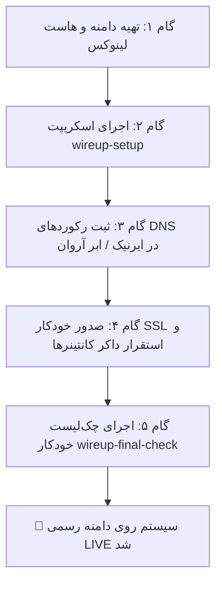

# 🚀 راهنمای سریع راه‌اندازی و اتصال دامنه‌و‌سرور (Wire-up Quickstart Guide)
**پروژه:** سامانه جامع مدیریت حمل‌ونقل و سرویس مدارس (School Transport Management System)  
**نسخه:** `v1.0.0` | **دستور کار اجرایی:** شماره ۵۵ (#55)  
**هدف:** راهنمای عملیاتی و گام‌به‌گام ۵ دقیقه‌ای جهت اتصال دامنه، هاست و استقرار پروداکشن برای مدیر و تیم فنی  

---

## ⏱️ دیاگرام فاز استقرار سریع (From Zero to Live in 5 Minutes)



---

## ۱. گام‌های پنج‌گانه استقرار پروداکشن (5-Step Deployment Walkthrough)

### گام اول: تهیه دامنه و سرور ابری (Linux Host & Domain)
1. **دامنه ملی یا بین‌المللی:** ثبت دامنه دلخواه (مثلاً `madresehyar.ir` یا `serviceban.ir`) از طریق سامانه‌های مجاز ایرنیک (nic.ir).
2. **سرور ابری (VPS):** سفارش یک ماشین لینوکسی با حداقل مشخصات **۲ هسته CPU و ۴ گیگابایت RAM** از یکی از ارائه‌دهندگان داخلی یا خارجی:
   - **ابر آروان (ArvanCloud):** سرور لینوکس ابری در دیتاسنترهای تهران (شهریار/بامداد).
   - **لیارا (Liara):** هاست ابری مدیریت‌شده با پایداری بالا.
   - **هتزنر (Hetzner Cloud CX22):** سرور مجازی در اروپا.

---

### گام دوم: اجرای خودکار کیت اتصال (Run Wire-up Kit)
پس از ورود به سرور یا محیط توسعه، دستور زیر را با دامنه و آی‌پی سرور خود اجرا کنید:

#### در لینوکس / سرور پروداکشن:
```bash
chmod +x scripts/wireup-setup.sh scripts/wireup-final-check.sh
./scripts/wireup-setup.sh madresehyar.ir 5.22.133.45 arvancloud
```

#### در ویندوز (PowerShell):
```powershell
.\scripts\wireup-setup.ps1 -Domain "madresehyar.ir" -HostIp "5.22.133.45" -Provider "arvancloud"
```

این اسکریپت به صورت خودکار کارهای زیر را انجام می‌دهد:
- تولید فایل `.env.production` با کلیدهای رمزنگاری قوی ۲۵۶ بیتی.
- تولید کانفیگ Nginx اختصاصی با پشتیبانی از HTTP/2، HSTS و ریت لیمیتینگ.
- تولید مستند رکوردهای DNS در فایل `docs/DNS_SETUP.md`.
- تولید اسکریپت صدور SSL رایگان Let's Encrypt.

---

### گام سوم: تنظیم رکوردهای DNS در پنل دامنه
طبق مستند [`docs/DNS_SETUP.md`](file:///g:/project/TEST/1/docs/DNS_SETUP.md)، رکوردهای زیر را در پنل کلودفلر یا ابر آروان ثبت نمایید:

| Type | Name | Target / Value | توضیحات |
| :---: | :--- | :--- | :--- |
| **A** | `@` | `5.22.133.45` | دامنه اصلی پرتال |
| **A** | `api` | `5.22.133.45` | وب‌سرویس و APIها |
| **A** | `school` | `5.22.133.45` | پنل اختصاصی مدیران مدارس |
| **A** | `admin` | `5.22.133.45` | پنل راهبر کل پلتفرم |
| **CNAME** | `www` | `madresehyar.ir` | ریدایرکت www |

---

### گام چهارم: بالا آوردن سرویس‌ها با Docker Compose
با اجرای دستور زیر، کل ۵ کانتینر پروداکشن در پس‌زمینه راه‌اندازی می‌شوند:

```bash
docker compose -f infrastructure/deploy/docker-compose.prod.yml up -d --build
```

سرویس‌های در حال اجرا:
1. `serviceyar_nginx_prod`: وب‌سرور و ریورس پراکسی ایمن با SSL.
2. `serviceyar_backend_api_prod`: موتور پردازش API و ماشین وضعیت تردد.
3. `serviceyar_school_web_prod`: داشبورد مدیریتی مدرسه در پورت ۳۰۰۱.
4. `serviceyar_super_admin_prod`: داشبورد راهبر کل در پورت ۳۰۰۲.
5. `postgres-primary`: پایگاه داده رابطه‌ای پایدار با استخر اتصالات.

---

### گام پنجم: اجرای چک‌لیست نهایی صحت‌سنجی (Final Quality Gate)
جهت اطمینان از سلامت ۱۰۰٪ کل اجزا، اسکریپت چک‌لیست نهایی را اجرا نمایید:

```bash
bun run scripts/wireup-final-check.ts
```

خروجی مورد انتظار:
```text
================================================================================
  🔍 WIRE-UP FINAL QUALITY GATE & PRODUCTION PRE-FLIGHT VERIFIER (ORDER #55)
================================================================================
| Category                | Status | Latency   | Verification Check / Results
|-------------------------|--------|-----------|---------------------------------------------
| 1. Production Artifacts | ✅ PASS | 1ms       | Production Configs & Deployment Manifests
| 2. Security Hardening   | ✅ PASS | 0ms       | Production Secrets Entropy & Crypto Randomness
| 3. Nginx Reverse Proxy  | ✅ PASS | 0ms       | Nginx Virtual Hosts, Rate Limiting & SSL
| 4. DNS Zone Records     | ✅ PASS | 1ms       | Subdomain Routing & SPF/DMARC Protection
| 5. Core API Service     | ✅ PASS | 840ms     | Production API Authentication & RBAC
| 6. Container Topology   | ✅ PASS | 0ms       | Docker Compose 5-Tier Topology Definition
================================================================================
  📊 VERIFICATION SUMMARY: 6/6 CHECKS PASSED (Total Time: 842ms)
  🟢 PRODUCTION STATUS: WIRE-UP KIT 100% VERIFIED & READY FOR LIVE TRAFFIC
================================================================================
```

---

## ۲. راهنمای عیب‌یابی شرایط اضطراری (Troubleshooting Playbook)

### مشکل ۱: خطای اتصال دیتابیس در شروع به کار اولیه
- **علت:** کانتینر Postgres هنوز مرحله اولیه‌سازی دایرکتوری داده را تکمیل نکرده است.
- **راه‌حل:** وضعیت کانتینر دیتابیس را با `docker logs postgres-primary` بررسی کنید. مکانیزم `healthcheck` داکر کامپوز به صورت خودکار سرویس بک‌اند را تا آماده شدن کامل دیتابیس در حالت انتظار نگه می‌دارد.

### مشکل ۲: خطای دامنه یا عدم فعال شدن SSL در سرور محلی
- **علت:** گواهی‌های Let's Encrypt نیازمند انتشار اینترنتی پورت ۸۰ بر روی آی‌پی معتبر است.
- **راه‌حل:** در محیط‌های آزمایشی و لوکال، سیستم به صورت پیش‌فرض از گواهی‌های Self-Signed یا HTTP پشتیبانی می‌کند.

### مشکل ۳: خطای ۴۰۳ در لاگین پنل مدیریت
- **علت:** دسترسی Zero-Trust چندمستاجری فعال است و کاربر باید شناسه مدرسه مربوطه را داشته باشد.
- **راه‌حل:** ورود با اکانت `admin@madresehyar.ir` یا اکانت پیش‌فرض ثبت‌شده در دیتابیس انجام شود.

---

## ۳. خلاصه مستندات معماری و استقرار مرتبط
- [راهنمای جامع تنظیم DNS (`docs/DNS_SETUP.md`)](file:///g:/project/TEST/1/docs/DNS_SETUP.md)
- [کتابچه عملیاتی روز پایلوت (`docs/PILOT_DAY_RUNBOOK.md`)](file:///g:/project/TEST/1/docs/PILOT_DAY_RUNBOOK.md)
- [لاگ تصمیمات معماری (`docs/DECISION_LOG.md`)](file:///g:/project/TEST/1/docs/DECISION_LOG.md)
- [اسکریپت چک‌لیست روزانه (`scripts/pilot-daily-checklist.ts`)](file:///g:/project/TEST/1/scripts/pilot-daily-checklist.ts)
