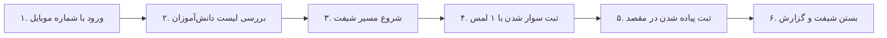

# 🚐 راهنمای سریع و تصویری راننده (Driver Quick Guide)
**سامانه مدیریت سرویس مدرسه (سرویس یار)** | **نسخه:** `v1.1.0`  
**مناسب برای:** چاپ روی یک برگه A4 و قرار دادن در خودروی راننده  

---

## 📱 ۱. دانلود و نصب اپلیکیشن
برای دریافت مستقیم فایل نصبی اپلیکیشن راننده، لینک زیر را باز کنید:
- **لینک دانلود مستقیم:** [دانلود اپلیکیشن راننده (ir.serviceyar.driver-v1.1.0.apk)](https://raw.githubusercontent.com/mytest19861986/sch-srv-anti/main/docs/releases/ir.serviceyar.driver-v1.1.0.apk)

---

## 🧭 ۲. فرآیند ۶ گام طلایی راننده در هر شیفت

### گام اول: ورود به برنامه (Login)
- شماره موبایل و رمز عبور پیامک‌شده از سوی مدرسه را وارد کنید.
- در صورت تست خانگی، روی «آدرس سرور» زده و IP کامپیوتر مدیر را تنظیم کنید.

### گام دوم: مشاهده مانیفست تردد (Shift Manifest)
- قبل از حرکت، لیست دانش‌آموزان شیفت صبح یا بعدازظهر را چک کنید.
- دانش‌آموزانی که والدین آنها **«عدم حضور»** ثبت کرده‌اند، با برچسب زرد و علامت غایب مشخص هستند و نیازی به توقف در منزل آنها نیست.

### گام سوم: تماس تک‌لمسی با والدین (One-Touch Call)
- در صورت تأخیر دانش‌آموز در ایستگاه، با لمس آیکون تلفن سبز رنگ مستقیماً با ولی دانش‌آموز تماس بگیرید.

### گام چهارم: ثبت سوار شدن (سوار شد / Picked Up)
- به محض سوار شدن دانش‌آموز، دکمه سبز رنگ **«سوار شد»** را لمس کنید. بلافاصله پیامک و نوتیفیکیشن برای والدین ارسال می‌شود.

### گام پنجم: ثبت پیاده شدن (پیاده شد / Dropped Off)
- پس از رسیدن به مدرسه یا مقصد، دکمه **«پیاده شد»** را ثبت کنید.
- *توجه:* سامانه به صورت خودکار مانع از ثبت پیاده شدن برای دانش‌آموزی که سوار نشده می‌شود (گارد ماشین وضعیت).

### گام ششم: پایان شیفت
- در پایان مسیر، دکمه «پایان شیفت» را بزنید تا گزارش برای مدیر مدرسه ارسال گردد.

---

## 📶 ۳. کارکرد در زمان قطعی اینترنت (Offline Sync)
- **آفلاین بودن را نگران نباشید:** تمامی دکمه‌ها و ثبت ترددها در حافظه امن گوشی ذخیره می‌شوند.
- به محض اتصال مجدد به اینترنت یا Wi-Fi، کلیه رویدادها به صورت خودکار با سرور همگام‌سازی (Sync) خواهند شد.
