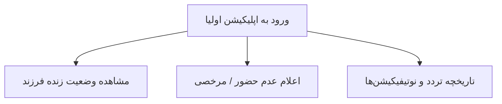

# 👨‍👩‍👧 راهنمای سریع اولیای دانش‌آموزان (Parent Quick Guide)
**سامانه مدیریت سرویس مدرسه (سرویس یار)** | **نسخه:** `v1.1.0`  
**مناسب برای:** تحویل به والدین در ابتدای سال تحصیلی و جلسه توجیهی  

---

## 📱 ۱. دانلود و راه‌اندازی اولیه اپلیکیشن
1. **دانلود فایل نصبی:** [دانلود اپلیکیشن والدین (ir.serviceyar.parent-v1.1.0.apk)](https://raw.githubusercontent.com/mytest19861986/sch-srv-anti/main/docs/releases/ir.serviceyar.parent-v1.1.0.apk)
2. **نام کاربری و کلمه عبور:** شماره تلفن همراه ثبت‌شده در مدرسه + رمز عبور پیامک‌شده.

---

## 🌟 ۲. امکانات و راهنمای کاربری والدین

### ۱. تابلوی زنده تردد فرزند (Live Status Dashboard)
- به محض اینکه راننده فرزند شما را سوار سرویس کند، وضعیت به رنگ سبز درآمده و نوتیفیکیشن «فرزند شما سوار سرویس شد» به همراه ساعت دقیق ثبت می‌شود.
- هنگام رسیدن به مدرسه یا منزل، پیام «فرزند شما در مقصد پیاده شد» ارسال می‌گردد.

### ۲. اعلام عدم حضور و مرخصی (Absence Reporting)
- در روزهایی که فرزند شما به مدرسه نمی‌رود یا با سرویس برنمی‌گردد:
  1. وارد بخش **«اعلام عدم حضور»** شوید.
  2. تاریخ و دلیل (مثلاً بیماری، مسافرت، رفت‌وآمد با والدین) را انتخاب کنید.
  3. با زدن دکمه تایید، این موضوع فوراً روی مانیفست راننده علامت می‌خورد تا معطل نماند.

### ۳. امنیت و حریم خصوصی (Zero-Trust Privacy)
- تنها ولی تاییدشده به مشخصات راننده، شماره پلاک خودرو و وضعیت تردد فرزند خود دسترسی دارد و اطلاعات سایر دانش‌آموزان به هیچ عنوان قابل مشاهده نیست.

---

## 📞 ۳. پشتیبانی و تماس با سرویس مدرسه
در صورت بروز هرگونه مشکل یا تغییر آدرس، با مدیریت امور سرویس مدرسه تماس حاصل فرمایید.
