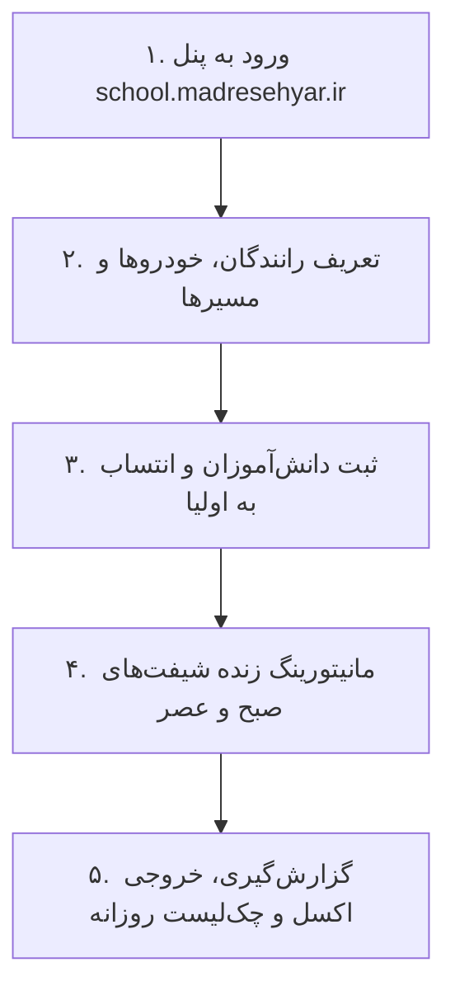

# 🏢 راهنمای جامع آموزش مدیر مدرسه و اپراتور (School Admin & Operator Training Guide)
**سامانه مدیریت سرویس مدرسه (سرویس یار)** | **نسخه:** `v1.1.0`  
**هدف:** تسلط کامل مدیر و اپراتور سرویس در ۵ مرحله بدون نیاز به حضور کارشناس فنی  

---

## 🎬 ۱. مراحل ۵ گانه مدیریت روزمره پنل مدرسه

### گام اول: ورود و تفکیک نقش‌ها (RBAC)
- ورود به پرتال مدیریت مدرسه (`http://localhost:3001` در دمو یا `https://school.madresehyar.ir`).
- اعتبارسنجی ایزولاسیون تننت: کلیه داده‌های نمایش داده شده صرفاً مربوط به همان مدرسه هستند.

### گام دوم: ثبت و مدیریت ناوگان (Drivers & Vehicles)
- افزودن راننده جدید با شماره تماس و شماره گواهینامه.
- اتصال راننده به خودرو (ون/مینی‌بوس/سواری) با ثبت ظرفیت مجاز و شماره پلاک.

### گام سوم: ثبت نام دانش‌آموزان و پیوند دوطرفه با اولیا
- در صفحه `/students`، ثبت دانش‌آموز به همراه پایه تحصیلی، کد ملی و مسیر سرویس.
- اتصال خودکار به اولیا و تولید رمز عبور اولیه جهت ارسال پیامکی به شماره همراه ولی.

### گام چهارم: مانیتورینگ زنده شیفت‌ها (Live Shift Monitoring)
- مشاهده در لحظه دانش‌آموزان سوار شده، پیاده شده و اعلام عدم حضور کرده.
- امکان ثبت تعویض راننده یا اختصاص سرویس جایگزین در صورت خرابی خودرو با ۳ کلیک.

### گام پنجم: خروجی اکسل (CSV Export) و چک‌لیست سلامت
- تهیه گزارش کامل حضور و غیاب ماهانه جهت تسویه حساب رانندگان.
- اجرای روزانه آزمون‌های سلامت سیستم قبل از شیفت صبح.

---

## 📚 ۲. چک‌لیست آمادگی اپراتور قبل از شروع سال تحصیلی
- [x] تکمیل لیست دانش‌آموزان و مسیربندی در پنل مدرسه.
- [x] ارسال پیامک حاوی لینک دانلود اپلیکیشن و رمز ورود به والدین.
- [x] جلسه توجیهی با رانندگان و تحویل راهنمای راننده ([`driver-quick-guide.md`](driver-quick-guide.md)).
- [x] اجرای اسکریپت چک‌لیست روزانه (`scripts/pilot-daily-checklist.ts`).
